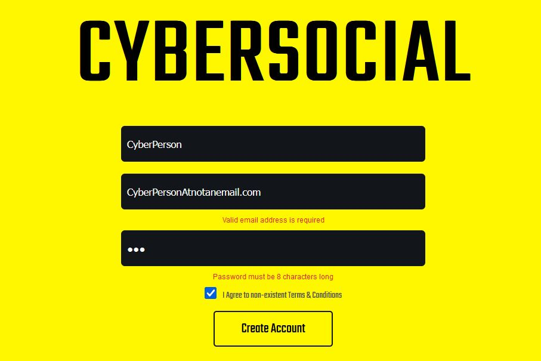

# Travel Journal - First React App

This is my [Firas Turak](https://www.linkedin.com/in/firasturak/) responsive solution for an account creating process. In this case the ficticious social network "Cybersocial". It was my second project with React JS. The solution asks the user for relevant data through a form, validates each input and upon success creates a card displaying the users profile details. In my next projects I plan to practice data retrieval.

## Table of contents

- [Screenshot](#screenshot)
- [Links](#links)
- [What I learned](#what-i-learned)
- [Author](#author)

## Screenshot

## Links

- Solution URL: [Click 'View Deployment'](https://github.com/fturak/create-account-form-react/deployments/activity_log?environment=github-pages)

## What I learned
- React JS
- Forms in React
- Hooks (UseState, UseEffect)

## Author

- Website - [Firas Turak](https://www.linkedin.com/in/firasturak/)
